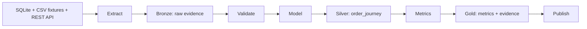

# FDE Assignment 2 — FlashEats Data Foundations

## Problem

Late deliveries hurt customer experience and create operational uncertainty. The central question is: **Where should FlashEats operations focus to reduce late deliveries, and is the available data trustworthy enough to identify the responsible workflow stage?** This repository answers with preserved source evidence, explicit quality gates, one order-grain model, and four descriptive metrics.

## Stakeholders

Operations needs a measurable late-delivery baseline; Support / Customer Experience needs a trustworthy account of customer impact; Dispatch / Delivery operations needs assignment context; Analytics / Data needs source and metric contracts. Finance is affected downstream by service failures and credits, but no refund or cost KPI is claimed here.

## Primary KPI

`late_completed_delivery_rate` is the percentage of `delay_metric_eligible` completed deliveries where `actual_delivery_at >` the **original** SQL `promised_eta`. The denominator excludes cancelled and unmeasurable orders. A newer dispatch ETA never replaces the original promise.

## Data Sources

The runtime pipeline uses four canonical sources: SQLite `orders` queried read-only; `customer_app_actions.csv` and `order_interventions.csv` read as files; and dispatch orders retrieved from the paginated REST API. The tracked `data/source/` fixtures and bundled local API allow a clean clone to run without instructor repositories or manual API startup. Other classroom sources were audited in Phase 0 but are not required at runtime.

## Architecture



Each attempt stages outputs under `data/.runs/<run_id>/`; checked directories are published to logical `run_date` partitions. The latest successful manifest is `data/run_manifest.json`.

## Source Map

| Source | Owner/role | Grain | Important fields | Authority | Known gap |
|---|---|---|---|---|---|
| SQLite `orders` | Owner unknown/not established; order lifecycle | Intended one order; raw conflicts exist | `order_id`, `created_at`, `promised_eta`, `pickup_at`, `actual_delivery_at`, `final_status` | Original promise and recorded lifecycle | Conflicting versions, chronology errors, missing completion |
| `customer_app_actions.csv` | Owner unknown/not established; app behavior | One action, many per order | `action_id`, `order_id`, `action_type`, `action_at` | Recorded app interactions only | Capture completeness unknown |
| `order_interventions.csv` | Owner unknown/not established; operations actions | One intervention, potentially many per order | `intervention_id`, `order_id`, `intervention_type`, `intervention_at` | Recorded actions, not causal outcomes | Selection policy and capture completeness unknown |
| Dispatch REST API | Owner unknown/not established; current dispatch snapshot | At most one record per order, checked | `order_id`, driver IDs, assignment times, current ETA | Dispatch assignment and current estimate | No full history or restaurant-arrival milestone |

See [source_map.md](docs/source_map.md) for retrieval modes and audited comparison sources.

## Validation Strategy

Checks report **PASS** for satisfied contracts, **WARN** for nonblocking concerns, **FAIL** for material defects, and **UNKNOWN** where evidence is insufficient. They cover schema, duplicate keys, timestamp parsing, lifecycle chronology, cross-source links, dispatch cardinality, and unresolved semantics. The supplied raw report remains FAIL for known order conflicts and chronology defects. Only four explicit, handled model-readiness FAIL IDs may proceed; any other FAIL blocks modelling. The raw report is retained unchanged.

## Workflow Model

`order_journey.csv` has one row per included canonical order. Exact duplicate rows can collapse with provenance; all versions of a conflicting order ID are excluded rather than choosing a winner. App actions and interventions aggregate by order before joining, and every join must preserve the parent key set. `sql_driver_id`, `dispatch_driver_id`, and `dispatch_original_driver_id` stay separate. Invalid chronology remains visible in eligibility flags; missing SQL completion is never filled from another source. See [workflow_model.md](docs/workflow_model.md).

## Metrics

| Primary metric | Definition and population |
|---|---|
| `late_completed_delivery_rate` | Late eligible completed orders / all delay-eligible orders, against original `promised_eta` |
| `median_lateness_minutes_among_late_orders` | Median `actual_delivery_at - promised_eta` among late delay-eligible orders |
| `median_creation_to_pickup_minutes` | Median `pickup_at - created_at` among duration-eligible orders; broad pre-pickup interval |
| `late_rate_by_pre_delivery_intervention_exposure` | Separate observed late rates for delay-eligible orders with/without a recorded pre-delivery intervention |

Definitions, exclusions, sample sizes, and caveats are in [metric_definitions.md](docs/metric_definitions.md). Support-opened share is supporting context, not a fifth primary metric.

## Key Findings

**Observed on the supplied classroom snapshot** for logical run date `2026-08-28`, from `data/gold/run_date=2026-08-28/metrics.json`: the late completed-delivery rate is about **56.37%**; median lateness among late eligible deliveries is **7.99 minutes**; median creation-to-pickup is **26.15 minutes**. The exposed and unexposed intervention cohorts have observed late rates of **56.62%** and **56.29%**, respectively. The rates are nearly similar descriptively, but intervention assignment is non-random and likely targeted to risk. These values are observations, never validation expectations. The data cannot reliably attribute delay to a restaurant or driver stage.

## Decision Output

Treat lateness as a material issue in the measurable completed-delivery cohort and monitor the eligible KPI. Investigate the broad pre-pickup interval operationally and improve instrumentation for restaurant-arrival and waiting milestones before assigning stage ownership. Do not use the intervention comparison as causal evidence. See [decision_output.md](docs/decision_output.md).

## Known / Unknown / Assumption / Limitation

| Category | Summary |
|---|---|
| Known | Four runtime sources; original promise defines lateness; raw conflicts/chronology defects; one-row-per-order model |
| Unknown | Source timezone contract, event-capture completeness, driver arrival at restaurant, production freshness SLA, causal intervention effect |
| Assumption | Trim/lowercase is representation-only normalization; logical run date names the output partition; no recorded child event is not proof of complete capture |
| Limitation | Conflicting parents excluded; impossible chronology and missing completion restrict eligibility; no defensible restaurant-versus-driver attribution or causal intervention conclusion; local publication is not a distributed transaction |

## Setup

Use Python 3.10 or newer. From `Assignment2/`:

```sh
python -m pip install -r requirements.txt
```

No notebook setup or manual API startup is required. Environment variables are documented in `.env.example`; that file is not automatically loaded.

## Run

```sh
python run_pipeline.py --run-date 2026-08-28
```

Published artifacts are under `data/raw/run_date=<RUN_DATE>/` (source evidence and validation report), `data/processed/run_date=<RUN_DATE>/` (order journey and model manifest), and `data/gold/run_date=<RUN_DATE>/` (metrics JSON and evidence CSV). `data/run_manifest.json` records the latest fully successful run with project-relative artifact paths and hashes. Failed attempts retain logs and diagnostics under `data/.runs/<run_id>/` without replacing the previous successful publication.

## Exit Codes

`0` success; `1` configuration/extraction/validation runtime failure; `2` unhandled validation FAIL; `3` model failure; `4` metric failure; `5` publication/finalization failure.

## Tests

```sh
python -m unittest discover -s tests -v
```

The latest full suite passed **53 tests, 0 failures, 0 skips**. Tests cover retrieval, validation, order grain, metric contracts, publication rollback, and rerun consistency.

## Repository Structure

```text
Assignment2/
├── data/source/       # tracked classroom fixtures and local API
├── pipeline/          # extraction, validation, modelling, metrics, publication
├── tests/             # synthetic and integration checks
├── docs/              # source reasoning, contracts, decisions, demo
├── handoff/           # phase review records
├── run_pipeline.py
└── requirements.txt
```

Generated `data/raw/`, `data/processed/`, `data/gold/`, `data/.runs/`, and `data/run_manifest.json` are ignored by Git.

## Demo

Follow the [four-minute demo script](docs/demo_script.md).
