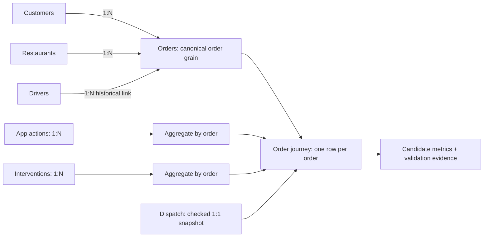

# Proposed minimum architecture

Documentation only. Nothing below has been implemented. The assignment PDF requires two or more retrieval modes, workflow modelling, 3-5 metrics, validation and a dependable entry point. It accepts a final evidence table; a dashboard is unnecessary. The eventual repository should be separate from instructor repositories and avoid personal absolute paths.

## Proposed repository layout

```text
README.md
requirements.txt
.env.example
.gitignore
run_pipeline.py
pipeline/
    config.py
    extract.py
    validate.py
    transform.py
    save.py
tests/
docs/                       existing Phase 0 documents; later model diagram
handoff/
data/
    source/                 approved, documented classroom snapshots
    raw/                    run evidence and manifests
    processed/              successful logical-date outputs
logs/
```

Use ordinary Python, pandas, requests and standard-library sqlite3/json/logging/pathlib. Flask is needed only if the approved local mock API is supplied with the student project. Reuse instructor dependency choices where appropriate; eventually record tested versions rather than depend on uncontrolled version changes. No packages, tests or source code were added in Phase 0.

Proposed eventual command: `python run_pipeline.py --run-date YYYY-MM-DD --source-root data/source`. Resolve relative paths against the student repository, validate arguments/configuration up front, and avoid recursive discovery of arbitrary parent directories. README must document environment setup and one-command pipeline execution. Use process environment variables with `.env.example` as documentation unless an explicit loader is added; do not imply that an example file is automatically loaded. Ignore real `.env`, secrets, runtime logs and generated outputs.

Clean-clone execution requires an approved source-distribution decision: include permitted small source snapshots and a minimal local API fixture, or provide a deterministic documented retrieval step that preserves exact source identity. The current machine's `refrence/` paths cannot be an undocumented evaluator dependency. No instructor repository is copied or altered in this phase.

## Proposed flow and model

1. Extract orders and required entity keys using read-only SQL; retrieve app actions/interventions from CSV and dispatch through HTTP. This demonstrates SQL, files and API retrieval. Load support, restaurant status and driver telemetry only for approved reconciliation/quality evidence. Raw preservation covers all selected inputs, not only API pages.
2. Validate schemas, retrieval completeness and key conflicts before transformations. Preserve original values; normalization and exclusion policies must be explicit. Keep source failures distinct from valid empty sources.
3. Normalize only approved representations, derive lifecycle intervals and nullable outcomes, and aggregate child actions/interventions by order. Use SQL orders as the proposed backbone, with current dispatch estimates kept separate from original promises. Never silently fill missing SQL completions from telemetry.
4. Enforce unique order IDs and unchanged order key set across left joins. Build metrics with explicit eligible cohorts, exclusions and sample sizes. Outcome CSV and compiled event exports are comparison evidence, not extra rows to append.
5. Stage journey, metric and validation artifacts, then publish a consistent successful run. Write diagnostics on failure as well. Use nonzero exit codes for invalid config, extraction/validation or publication failure; zero only for an explicitly successful run.



Keep entity, event, state, interaction, intervention and outcome concepts explicit without creating a large warehouse. SQL lifecycle timestamps and observed event logs provide events; status snapshots provide states; app actions are interactions; operations actions are interventions; delay/status are outcomes. One customer or driver can have many orders. A current driver assignment is not necessarily the historical driver FK.

## Class 8 implementation audit and reuse classification

All references in this section are under `refrence/flasheats-data-pipeline/Class8_Project/`. Static inspection only; the instructor pipeline was not run because it writes into that repository. A = concept to reuse; B = implementation pattern to adapt; C = classroom-specific behavior not to copy blindly.

| Technique | Inspected implementation | Classification and proposed treatment |
|---|---|---|
| Stage separation | `run_pipeline.py` calls extract, raw validation, cleaning, journey/metrics, save | A: retain a readable staged entry point; do not copy the project |
| SQL/file extraction | `pipeline/extract.py` loads four SQL tables, mixed interactions and interventions | B: adapt loaders to selected fields and read-only SQL; prefer app actions for the chosen interaction metric |
| API extraction | Session GET, 5-second timeout, page counter, accumulated rows, `has_more`, first total | B: validate every envelope, progress, unique IDs and totals including zero; current truthy-total guard misses zero/missing-total cases |
| Retry/backoff | Up to `MAX_RETRIES` attempts; retries 429/500/502/503/504 and request exceptions; exponential delay; numeric header/body retry delay | B: retain bounded transient retry; validate/cap delays and handle malformed hints; no retry for semantic/schema errors |
| Mock API startup | Health check, subprocess, shutdown in `finally` | B: adapt process cleanup if needed; C: fixed instructor script/port and pack layout are not a portable source contract |
| Required-column checks | `pipeline/validate.py` checks order columns and two dispatch columns | A/B: extend only to selected source contracts; current validation does not validate child schemas, join cardinality or lifecycle chronology |
| Null and duplicate checks | Duplicates WARN; delivered nulls checked before parsing | C: raw null check misses malformed non-null timestamps; conflicting keys need resolution, not unconditional keep-first |
| Freshness | Latest order creation versus logical date, default 60-day allowance | C: not a universal SLA or extraction timestamp; does not reject future data; agree historical-mode semantics |
| Cleaning | `pipeline/clean.py` keeps first order ID, lowercases status/traffic, parses datetimes with coercion | B for explicit normalization/parsing; C for first-row conflict selection or unreported coercion |
| Transform | `pipeline/transform.py` aggregates interactions/interventions; left joins dispatch; fills counts with zero | A for aggregation; B with cardinality checks; C for zero without capture completeness or counting conflicting interaction IDs |
| Dispatch fields | Selects optional `assigned_driver_id`, `reassignment_count` | C: neither exists in inspected API data; use real fields and do not invent reassignment counts |
| Metric semantics | `is_late = delay_min > 0`; measurable cohort checks only two timestamps | C: null delay becomes false at flag creation; eligibility does not explicitly filter delivered/cancelled or lifecycle violations; report unknown separately |
| Configuration | Frozen dataclass, environment values, `.env.example` | B: reuse simple typed config with bounds; no dotenv loader exists; invalid config/root discovery can fail before main error handling |
| Logging | `logging_utils.py` console/file formatter, counts/stages, exception logs | B: maintain clear stage/source/count/retry messages; keep input content/secrets out of logs |
| Raw preservation | Successful API JSON payloads serialized before processing | A: preserve evidence; C: only API payloads are saved, writes are direct and same-date pages overwrite; stale extra pages can survive reruns |
| Output partitioning | `data/processed/run_date=...` contains CSV plus metrics and validation JSON | B: simple logical-date outputs; no need for three separately named storage layers |
| Idempotency | Same date targets same filenames; no append | A concept; C implementation is not a transaction and raw pages lack attempt isolation |
| Atomic writes | `save.py` temporary CSV in destination directory then `os.replace` | B for per-file replace; JSON uses ordinary `write_text`; whole partition is not atomically replaced despite README wording |
| Failure handling | ValidationError -> 2; other caught exceptions -> 1; successful run -> 0; API cleanup | B: expand coverage to initialization and emit failure validation JSON; current reports are saved only on success and prior successful outputs remain |

The mock API source in the classroom pack deliberately returns first-hit HTTP 500 on page 3 and 429 on page 5. It caps page size at 200 and exposes total/page/has_more metadata plus a per-order endpoint. This behavior was read, not exercised; future retrieval should use the API rather than pretend a backing-file read is HTTP extraction.

## Minimal dependable publication proposal

Use an isolated attempt directory containing raw evidence, source hashes/counts and staged outputs. Atomically write each artifact, then update a small successful-run manifest only after all checks and writes succeed. Consumers resolve that manifest so they cannot read a mixed partial run. Keep logical date stable for reruns and attempt identity separate for diagnostics. This is a small alternative to claiming that several individual file replacements form an atomic transaction.

`metrics.json` should include metric definition/version, value, numerator/denominator or sample size, units and exclusions. `validation_report.json` should include source/stage/check/severity, observed counts, rule conditions, unresolved issues and publication decision. Both must be valid strict JSON, including empty-cohort handling. Logs explain failures; machine-readable reports allow automated evaluation without notebook state.

Future minimum validation should cover a clean-clone run, repeat of the same inputs/date, conflicting keys, malformed timestamps, failed/incomplete API retrieval, empty metric cohorts and interrupted publication. Use small deliberate cases that exercise invariants, not assertions of the classroom's 843/1,495 counts. No future tests are implemented now.

## Decisions requiring review

Approve source distribution, authoritative field ownership, duplicate conflicts, metric population/threshold, timezone, normalization aliases, timing/exclusion rules, completeness expectations and freshness SLA. Stage attribution must remain limited while restaurant arrival is uninstrumented. See `handoff/PHASE_0.md` for the explicit questions.
