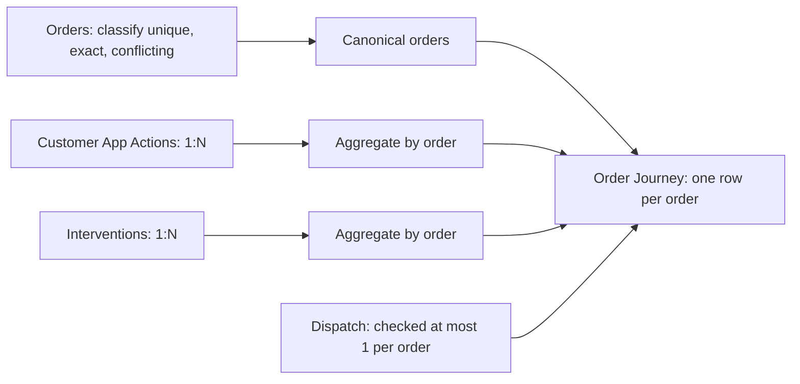

# FlashEats Phase 3 workflow model

The analytical grain is **one row per included canonical order** in `data/processed/run_date=<RUN_DATE>/order_journey.csv`. SQL orders are the parent. `model_manifest.json` records how the parent grain was obtained and verifies every join. This model prepares evidence for later decisions; it does not publish a late-delivery KPI.

An **entity** is an order linked to its customer, restaurant and historical SQL driver. **Events** include order creation, pickup, completion, app actions, operational interventions and dispatch assignment timestamps. **States** include final order status, traffic/weather context and current dispatch status/ETA. **Interactions** come only from `customer_app_actions`; `ETA_VIEWED`, `SUPPORT_OPENED` and `CANCEL_ATTEMPTED` retain distinct counts. **Interventions** come only from `order_interventions`; total, in-flight, post-delivery and unclassified counts remain separate. **Outcome readiness** is represented by `chronology_valid`, `delay_metric_eligible` and `duration_metric_eligible`; no outcome rate or duration metric is calculated.

Orders with identical duplicate rows collapse to one parent and retain `source_order_row_count` and `exact_duplicate_collapsed`. For conflicting duplicate IDs, no version wins: all versions are excluded from `order_journey.csv` and listed with `model_excluded: true` and reason `conflicting_order_versions` in the manifest. A unique order with impossible chronology stays in the model with appropriate flags set false. Missing SQL completion stays null; dispatch's current ETA never replaces the original SQL promise. Raw status, traffic and weather values remain beside trim/lowercase representation fields. Semantic aliases are not merged.

App actions and interventions are each grouped by `order_id` before any left join. Every child aggregate and dispatch is checked for unique order IDs before joining. After each left join, row count, unique order count and key set must match the canonical parent; an unexpected fan-out raises an error. Zero joined child counts mean **no recorded child rows**, while capture completeness remains unknown. Child rows linked to excluded/conflicting orders are counted as not joined in the manifest.

An intervention is marked in-flight only when its recorded time is between recorded creation and delivery, inclusive. Post-delivery interventions stay in audit counts but do not count as rescues. Missing completion, malformed or incomparable time, and pre-creation actions are unclassified. `driver_assignment_changed` compares dispatch original versus current driver only when both are known; SQL, dispatch current and dispatch original driver IDs remain separate. These comparisons are descriptive and do not establish intervention effectiveness.

The selected sources do not record `driver_arrived_at_restaurant`. The model therefore cannot separate restaurant preparation from driver travel or waiting, and it assigns no stage blame. Timezone and event capture contracts also remain unresolved. The Phase 2 raw report can remain FAIL while this transparent model is built under the four explicitly approved exception check IDs; all other validation FAILs block modelling.
